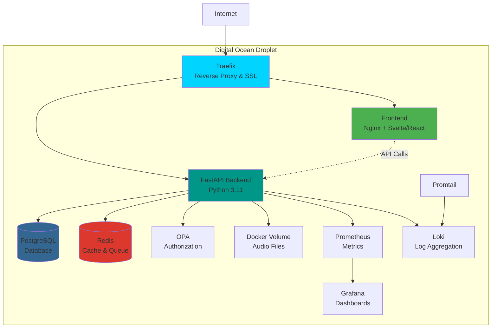
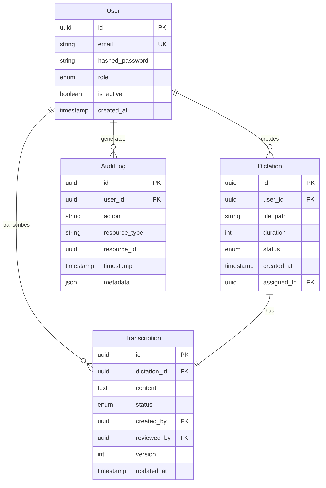
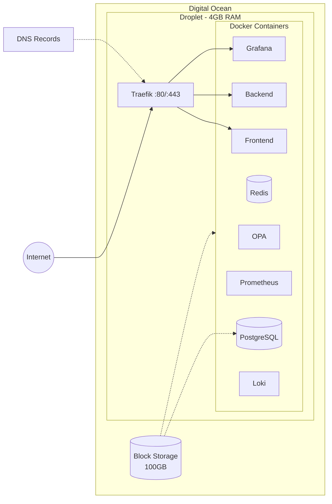
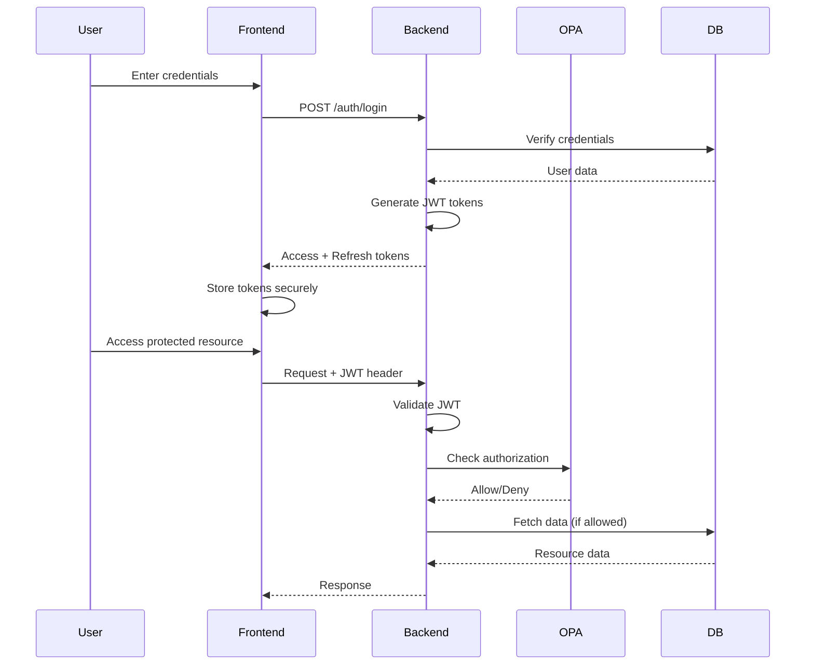

# Dictat

A self-hosted medical dictation service enabling healthcare professionals to record voice dictations and secretaries to transcribe them into structured markdown documents.

## Overview

Dictat provides a complete workflow for medical dictation management:

- **Doctors** record voice dictations via browser or upload audio files
- **Secretaries** access a work queue, claim dictations, and transcribe using an integrated markdown editor
- **Doctors** review and approve completed transcriptions
- **Administrators** manage users, monitor system health, and ensure compliance

## Technology Stack

### Backend
- **FastAPI** - Modern async Python web framework
- **Python 3.11+** - Runtime environment
- **UV** - Fast Python package manager and dependency resolver
- **PostgreSQL 15+** - Primary relational database
- **SQLAlchemy 2.0+** - Async ORM with asyncpg driver
- **Alembic** - Database migration management
- **Redis** - Caching, session storage, and message broker
- **Celery/ARQ** - Distributed task queue for background jobs
- **Open Policy Agent (OPA)** - Policy-based authorization engine
- **python-jose** - JWT token generation and validation
- **passlib[bcrypt]** - Secure password hashing

### Frontend
- **Svelte** or **React** - Modern UI framework
- **Vite** - Lightning-fast build tool
- **TypeScript** - Type-safe JavaScript
- **Tailwind CSS** - Utility-first CSS framework
- **TanStack Query** - Server state management
- **Zod** - Schema validation
- **CodeMirror/Monaco** - Markdown editor
- **MediaRecorder API** - Browser-based audio recording

### Infrastructure
- **Docker & Docker Compose** - Containerization and orchestration
- **Traefik** - Reverse proxy, load balancer, SSL termination
- **Terraform** - Infrastructure as Code for Digital Ocean provisioning
- **Digital Ocean Droplet** - Single-server deployment
- **Docker Volumes** - Persistent storage for audio files and database
- **Prometheus** - Metrics collection
- **Grafana** - Metrics visualization and dashboards
- **Loki** - Log aggregation
- **Promtail** - Log collection and shipping

### Development Tools
- **pytest** - Python testing framework
- **Vitest** - Frontend unit testing
- **Playwright/Cypress** - E2E testing
- **ruff** - Fast Python linter
- **black** - Code formatter
- **mypy** - Static type checker
- **ESLint** - JavaScript/TypeScript linter
- **pre-commit** - Git hooks for code quality

## Architecture



### Key Architecture Decisions

1. **Streaming-Only File Access** - Audio files are streamed from Docker volumes, never cached in memory
2. **Single-Server Deployment** - Docker Compose on Digital Ocean for simplicity and cost-effectiveness
3. **Infrastructure as Code** - Terraform manages all cloud resources
4. **Policy-Based Authorization** - OPA handles complex role-based access control
5. **Async Architecture** - FastAPI with async/await for high concurrency
6. **Monitoring-First** - Prometheus/Grafana/Loki integrated from the start
7. **Security-Focused** - UK GDPR compliant audit logging, encryption, JWT authentication

## Data Model



### Workflow States

**Dictation Status**: `pending` → `assigned` → `in_progress` → `completed` → `reviewed`

**User Roles**: `doctor`, `secretary`, `admin`

## Development Setup

### Prerequisites

- Python 3.11+
- Node.js 18+
- Docker and Docker Compose
- UV (Python package manager)
- pnpm or npm

### Local Development

1. **Clone the repository**
   ```bash
   git clone <repository-url>
   cd Dictat
   ```

2. **Set up environment variables**
   ```bash
   cp .env.example .env
   # Edit .env with your configuration
   ```

3. **Start services with Docker Compose**
   ```bash
   docker-compose up -d postgres redis
   ```

4. **Backend setup**
   ```bash
   # Install UV if not already installed
   curl -LsSf https://astral.sh/uv/install.sh | sh

   # Install dependencies
   uv sync

   # Run migrations
   uv run alembic upgrade head

   # Start development server
   uv run uvicorn main:app --reload
   ```

5. **Frontend setup**
   ```bash
   cd frontend
   pnpm install
   pnpm dev
   ```

6. **Access the application**
   - Frontend: http://localhost:5173
   - Backend API: http://localhost:8000
   - API Docs: http://localhost:8000/docs

### Code Quality & Git Hooks

We use pre-commit hooks to ensure code quality and consistency. Install them once:

```bash
# Install pre-commit hooks
./scripts/setup-hooks.sh
```

This will set up automatic checks that run before each commit:

**Python:**
- **Black** - Code formatting (100 char line length)
- **Ruff** - Fast linting and import sorting
- **mypy** - Static type checking
- **Bandit** - Security vulnerability scanning

**General:**
- **Hadolint** - Dockerfile linting
- **ShellCheck** - Shell script linting
- **Markdownlint** - Markdown formatting
- **YAML/JSON validators** - Configuration file validation

**Frontend (when available):**
- **ESLint** - JavaScript/TypeScript linting
- **Prettier** - Code formatting
- **TypeScript** - Type checking

**Manual commands:**
```bash
# Run all hooks manually
pre-commit run --all-files

# Update hook versions
pre-commit autoupdate

# Bypass hooks (not recommended)
git commit --no-verify
```

### Running Tests

```bash
# Backend tests
uv run pytest

# Backend tests with coverage
uv run pytest --cov=. --cov-report=html

# Frontend tests
cd frontend
pnpm test

# E2E tests
pnpm test:e2e
```

## Production Deployment

### Digital Ocean Deployment with Terraform

#### Prerequisites

- Digital Ocean account
- Digital Ocean API token
- Terraform installed locally
- Domain name configured

#### Infrastructure Setup

1. **Configure Terraform variables**
   ```bash
   cd terraform
   cp terraform.tfvars.example terraform.tfvars
   # Edit terraform.tfvars with your settings
   ```

2. **Initialize and apply Terraform**
   ```bash
   terraform init
   terraform plan
   terraform apply
   ```

   This will provision:
   - Digital Ocean Droplet (recommended: 4GB RAM minimum)
   - Block storage volume for Docker volumes
   - Firewall rules (ports 80, 443, 22)
   - SSH key configuration
   - DNS records (if using Digital Ocean DNS)

3. **Deploy application**
   ```bash
   # SSH into the droplet
   ssh root@your-droplet-ip

   # Clone repository
   git clone <repository-url>
   cd Dictat

   # Set up environment
   cp .env.example .env
   # Edit .env with production settings

   # Deploy with Docker Compose
   docker-compose -f docker-compose.prod.yml up -d
   ```

#### Deployment Architecture



### Environment Variables

Key environment variables (see `.env.example` for complete list):

- `DATABASE_URL` - PostgreSQL connection string
- `REDIS_URL` - Redis connection string
- `JWT_SECRET_KEY` - Secret for JWT token signing
- `STORAGE_PATH` - Path to Docker volume for audio files
- `OPA_URL` - Open Policy Agent endpoint
- `DOMAIN` - Your domain name for SSL certificates
- `DO_API_TOKEN` - Digital Ocean API token (Terraform)

### SSL/TLS Certificates

Traefik automatically provisions and renews Let's Encrypt SSL certificates:

```yaml
# docker-compose.prod.yml excerpt
traefik:
  command:
    - --certificatesresolvers.letsencrypt.acme.email=your-email@example.com
    - --certificatesresolvers.letsencrypt.acme.storage=/letsencrypt/acme.json
```

### Backups

Automated backup strategy:

1. **Database backups** - Daily PostgreSQL dumps to Digital Ocean Spaces
2. **Volume backups** - Daily snapshots of block storage
3. **Configuration backups** - Git repository for infrastructure as code

```bash
# Manual backup
docker exec dictat-postgres pg_dump -U postgres dictat > backup.sql

# Restore
docker exec -i dictat-postgres psql -U postgres dictat < backup.sql
```

## Security & Compliance

### UK GDPR & Data Protection (Isle of Man)

The Isle of Man has its own data protection legislation aligned with UK GDPR. Dictat implements:

**Data Protection Principles:**
- **Lawfulness, Fairness, Transparency** - Clear privacy policy and consent mechanisms
- **Purpose Limitation** - Data collected only for medical dictation purposes
- **Data Minimization** - Only essential information is collected
- **Accuracy** - Mechanisms for users to update their information
- **Storage Limitation** - Configurable data retention policies
- **Integrity & Confidentiality** - Encryption and access controls
- **Accountability** - Comprehensive audit logging

**Technical Measures:**
- **Audit Logging** - All data access and modifications are logged with immutable audit trail
- **Encryption at Rest** - PostgreSQL encryption and encrypted Docker volumes
- **Encryption in Transit** - TLS/SSL via Traefik with Let's Encrypt certificates
- **Access Control** - Role-based access via OPA policies
- **Data Retention** - Configurable retention policies with automated deletion
- **Session Management** - Secure JWT tokens with refresh mechanism
- **Right to Erasure** - API endpoints for user data deletion (GDPR Article 17)
- **Data Portability** - Export functionality for user data (GDPR Article 20)

**Compliance Features:**
- Data Processing Agreement templates
- Privacy Impact Assessment documentation
- Breach notification procedures
- Subject Access Request (SAR) handling

### Authentication Flow



### Authorization (OPA)

Policies are defined in Rego and enforce:
- Role-based access (doctor/secretary/admin)
- Resource ownership (users can only access their own dictations)
- State transitions (only secretaries can mark as in_progress)
- Administrative actions (only admins can manage users)
- Data segregation (secretaries cannot access other secretaries' work)

## Monitoring & Observability

### Metrics (Prometheus + Grafana)

Access Grafana at `https://monitoring.yourdomain.com`

**Dashboards:**
- Request rate, latency, error rate (RED metrics)
- Custom metrics: dictations uploaded, transcriptions completed
- Database connection pool statistics
- Disk I/O and storage usage
- Service health checks
- Container resource usage (CPU, memory)

### Logs (Loki + Promtail)

- Structured JSON logging
- Centralized log aggregation
- Query logs by service, level, user, or request ID
- Audit log retention for compliance (7 years recommended for medical records)

### Alerting

Configure Grafana alerts for:
- Service downtime
- High error rates (>1%)
- Database connection failures
- Disk space warnings (<20% free)
- Unusual access patterns
- Failed authentication attempts (>10/minute)
- SSL certificate expiration (30 days warning)

## API Documentation

Once running, interactive API documentation is available at:

- **Swagger UI**: http://localhost:8000/docs
- **ReDoc**: http://localhost:8000/redoc

Key endpoints:

- `POST /auth/register` - User registration
- `POST /auth/login` - User login
- `POST /dictations` - Upload dictation
- `GET /dictations/queue` - Get work queue (secretaries)
- `POST /dictations/{id}/claim` - Claim dictation
- `POST /transcriptions` - Submit transcription
- `PUT /transcriptions/{id}` - Update transcription
- `POST /dictations/{id}/review` - Review and approve
- `GET /user/data-export` - Export user data (GDPR)
- `DELETE /user/account` - Delete user account (Right to Erasure)

## Contributing

1. Create a feature branch from `main`
2. Set up git hooks (if not already done): `./scripts/setup-hooks.sh`
3. Make your changes
4. Git hooks will automatically run on commit (formatting, linting, type checking)
5. Run tests: `uv run pytest`
6. Submit a pull request

### Code Quality

Pre-commit hooks will automatically run these checks, but you can also run them manually:

```bash
# All hooks
pre-commit run --all-files

# Individual tools
uv run black .              # Format code
uv run ruff check --fix .   # Lint and fix
uv run mypy .               # Type checking
uv run bandit -r .          # Security scanning
uv run safety check         # Dependency vulnerabilities
```

## License

GNU General Public License v3.0 - see [LICENSE](LICENSE) file for details.

## Support

For issues and questions:
- Create an issue in the repository
- Contact the development team

## Roadmap

See [TODO.md](TODO.md) for detailed development tasks and project roadmap.

## Testing

See [Test_Targets.md](Test_Targets.md) for comprehensive testing strategy and targets.

## Infrastructure Cost Estimate

**Digital Ocean Monthly Costs (estimated):**
- Droplet (4GB RAM, 2 vCPU): $24/month
- Block Storage (100GB): $10/month
- Bandwidth (1TB included): $0/month (typical usage)
- Backups (optional): $4.80/month (20% of droplet cost)
- **Total: ~$39-44/month**

Scale up to 8GB RAM droplet ($48/month) if handling >50 concurrent users.
